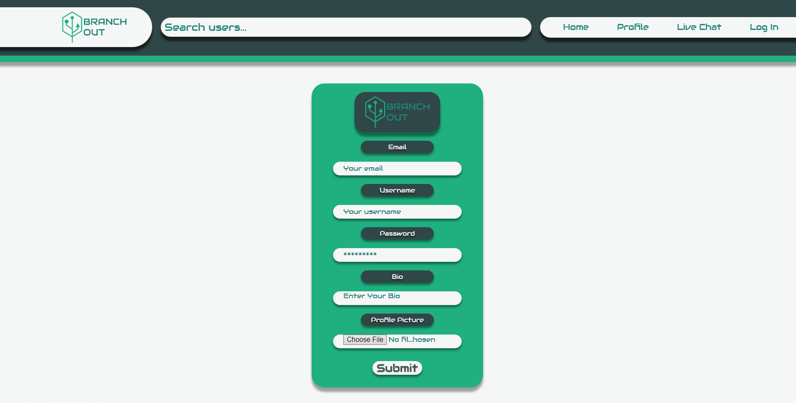
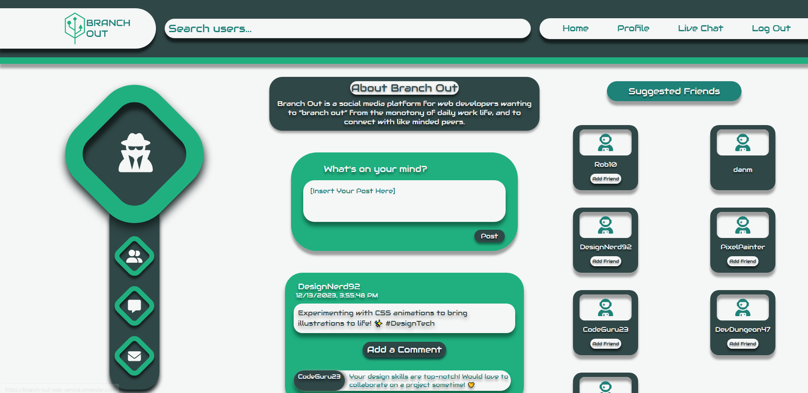
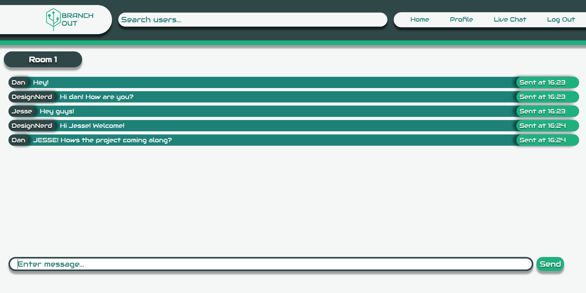
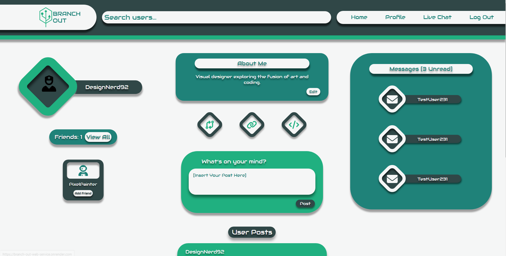

# Branch-Out

  

## Table of Contents

- [Description](#description)
- [Features](#features)
- [Technologies](#technologies)
- [Deployed Application](#deployed-application)
- [License](#license)
- [Contribution](#contribution)
- [Tests](#tests)
- [Questions](#questions)

## Description

Branch Out is a social media platform designed specifically for web developers who want to connect with like-minded peers. Whether you're looking to share your latest project, seek advice, or collaborate on exciting ventures, Branch Out is the place for you.

## Features

- **Profile Creation:** Create and edit your own profile with your image being stored to an AWS S3 bucket.
- **Connect with Peers:** Find and connect with other web developers who share your interests.
- **Project Showcase:** Showcase your latest projects and explore what others are working on.
- **Collaboration:** Collaborate on projects, seek advice, and share knowledge with the community.
- **Real-time Chat:** Use the integrated chat room powered by Socket.IO to communicate with other developers instantly.

## Technologies

Branch Out is built using the MERN stack:

- MongoDB: Document database for storing user profiles, projects, and other data.
- Express: Server framework for handling HTTP requests and routing.
- React: Front-end library for building interactive user interfaces.
- Node.js: Server-side JavaScript runtime for building scalable applications.
- JSON Web Token (JWT): Token-based authentication for secure user access.
- GraphQL: Query language for APIs to efficiently request and update data.
- Redux Toolkit: State management library for predictable state containers.
- Socket.IO: Real-time web socket library for enabling instant communication.

## Deployed Application

Click the lightning bolt
[⚡](https://branch-out-web-service.onrender.com/) to go to "Branch Out" on Render!

## License

This project is licensed under the terms of the **[MIT License](https://opensource.org/licenses/MIT)**.

## Contribution

Robert Kaiser, Daniel Merkin, Jesse LoCascio, John Post

## Tests

No specific testing information is provided at this time.

## Questions

If you have any questions or suggestions about this project, please feel free to
contact us:

- GitHub: [@RobKaiser97](http://github.com/RobKaiser97),
  [@dmerk2](http://github.com/dmerk2),
  [@jeslocascio](http://github.com/jeslocascio),
  [@Jp0st](http://github.com/Jp0st)
- Email: paintballmanrob@gmail.com, dan.merkin@gmail.com, locascioje@gmail.com,
  jpost2010@gmail.com
